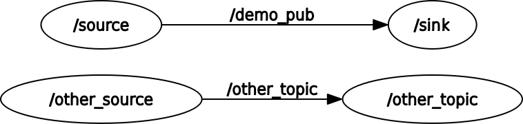

# ros-monkeywrench

ROS tooling for intentionally disrupting communications and functionality to
build more resilient robot software systems.

## Background

To ensure resilient robot systems, it is necessary to be able to push them to
their limits and evaluate what takes place at these limits. This package
currently provides tooling for the former and aims to provide tooling for the
latter in the not-too-distant future.

To 'push to their limits', we can take advantage of the fact that ROS messages
are structured collections of data. Failure cases can therefore be reduced to
manipulations of this data: data not getting to where it's supposed to be, not
getting there fast enough, data being wrong, etc.

This is the purpose of the monkeywrench node: it subscribes to the specified
topic, and immediately publishes anything it receives. This node also provides
a service, which can be called to trigger various failure cases: when data is
received, it is modified before publishing. These modifications might be to
replace data with random noise, to alter the timestamp in a header, to stop
publishing entirely, and more. In this way, the flow of data can be altered.

However, manually inserting this node into every pipeline of interest may be
prohibitively time consuming when attemping to test your stack. Instead, the
monkeylaunch utility is provided. This utility wraps roslaunch, except
monkeylaunch also takes a configuration file which specifies the nodes
and topics to intercept. In this way, existing roslaunch-based stacks
can be very quickly spun up for testing.

## Usage

A demo launch file is provided as `testlaunch.launch`. Running it with
`roslaunch monkeywrench testlaunch.launch`, the following graph is produced:



A config file is provided as `./config/testconfig.txt`. It contains the
following:

```
source:demo_pub
other_source:other_topic
wonk:third_topic
```

This config file is of the format "node name:topic". Each line is a different
monkeywrench node which will be launched. Note that there is an additional
node:topic pair here which does not correspond to anything in the graph, which
will be ignored.

When you have installed this package, you will have a new executable called
`monkeylaunch`. It wraps `roslaunch` and takes the same arguments, except it
expects the final argument to be a path to a config of the form demonstrated
above.

You can see this by running the same launchfile as above, except now using
monkeylaunch and providing a config file:

`monkeylaunch monkeywrench testlaunch.launch testconfig.txt`

Make sure you specify a valid path to your config. This produces a new graph:


Note that this is the identical flow of information, except there are now two
auto-generated monkeywrench nodes inserted in between the previous sources and
sinks. Using this, that flow of information can be interrupted.
